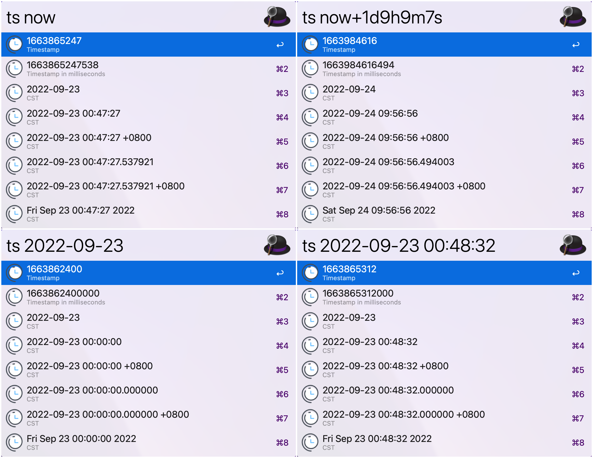

# easy-timestamp-workflow
It's an Alfred workflow to make timestamp or date conversion easy and rapid.

## Usage
**Alfred Keyword: `ts`**

- timestamp -> formatted date
  - support timestamp in seconds and milliseconds
- date -> timestamp
  - support all formats you get from easy-timestamp
- get current timestamp by **`now`**
  - support adding/subtracting time string formatted like `1d`, `9h`, `9m`, `7s`, `1d1h2m4s`

## Demo

## Install
Download directly [easy-timestamp](https://github.com/swxu/easy-timestamp-workflow/raw/main/easy-timestamp.alfredworkflow)
